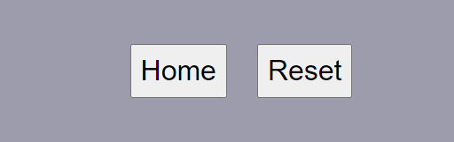

# Rock Paper Scissors Lizard Spock

RPSLS is an easy game designed for any type of audience, especially for fans of the serie "The Bigbang Theory", as this version of the game became popular because of it. To make it a bit more exciting, the game presents 3 possible variations:
- classic
- 5vs5
- random

# [Visit the game here](https://max9414.github.io/RPSLS/)

# All the titles bring back to the Table of Content

# Table of Content
1. [Project Goals](#project-goals)
   - [Site Owner Goals](#site-owner-goals)
   - [User Goals](#user-goals)
   - [Target Audience](#target-audience)
2. [Features](#features)
3. [Existing Features](#existing-features)
   - [Navigation Bar](#navigation-bar)
   - [The landing page](#the-landing-page)
   - [Game Area section](#game-area-section)
   - [Original game section](#original-game-section)
   - [Random game section](#random-game-section)
   - [5vs5 game section](#5vs5-game-section)
   - [The results pages](#the-results-pages)
   - [The Footer](#the-footer)
   - [The Header](#the-header)
   - [Explanation section](#explanation-section)
4. [Features Left to Implement](#features-left-to-implement)
5. [Testing](#testing)
   - [Validator Testing](#validator-testing)
6. [Unfixed Bugs](#unfixed-bugs)
7. [Deployment](#deployment)
8. [Credits](#credits)
9. [Content](#content)
10. [Media](#media)

## [Project Goals](#table-of-content)

RPSLS aims to let people enjoy an easy game with different challenges, enjoy a quick, fast paced and easy to understand game. The idea was taken from the suggested websites to create and drew on a couple of papers before starting coding.

### [Site Owner Goals](#table-of-content) 
- Test User luck
- Provide different game options
- Provide new game function to reset score
- Provide entertainment
- Show both user and pc scores

### [User Goals](#table-of-content)
- Easily navigate through the game
- Understand the rules of the game
- Get cards upon starting the game
- See if they win or lose during the game
- See score while playing the game and upon completion of the game
- Easily reset the game

### [Target Audience](#table-of-content)
- The Bigbang Theory fans
- Rock paper scissors fans searching for a more challenging version
- Whoever needs a little brain restart

## [Features](#table-of-content) 

Fun, challenges and explanations all within sight and reachable with an easy click!

### [Existing Features](#table-of-content)

#### [Navigation Bar](#table-of-content)
  - Mutable navigation bar, changing on the different pages to bring the game experience to the next level!
  - On the main page you can access all the 3 different games with each specific button.

  - On the original game you can just go back to the homepage, no different actions needed for the game.

  - On the 5vs5 game you have the home button and the reset button, to bring back the selected cards to 0.

  - On the random game you have the home button and the shuffle button, which will mix again the card to give you new ones!

- #### [The landing page](#table-of-content)

  - As I focused mainly on the logic with javascript, the landing page is really simple, with a title, a subtitle, buttons to play and a pic to show briefly which card wins against which.

- #### [Game Area section](#table-of-content)

  - This section is the only section in the page that changes, mutating its HTML on every different button interaction
  - It has an easy grey colour background to help the user see clearly which one is the game section

- #### [Original game section](#table-of-content)

  - This section will allow the user to play the original game or bring them back to the homepage.
  - With every interaction with the card, a popup message will appear asking to confirm or cancel the choice.
  - The page will then change to show who won, update the score and show the played cards.

- #### [Random game section](#table-of-content)

  - This section will allow the user to play the random game, bring them back to the homepage or reshuffle the cards.
  - With every interaction with the card, a popup message will appear asking to confirm or cancel the choice.
  - The page will then change to show who won, update the score and show the played cards.
  - On shuffle, the function for the random game will be called again and it will give you 3 new cards.

- #### [5vs5 game section](#table-of-content)

  - This section will allow the user to play the 5vs5 game, bring them back to the homepage or reset the choice.
  - When all the 5 cards will be selected, a popup message will appear asking to confirm or cancel the choice.
  - Selecting the card again, the card will be deselected.
  - The page will then change to show who won, update the score and show the played cards for all 5 choices in order of choice.
  - On reset, the function for the 5vs5 game will be called again and it will basically deselect all the cards for the user.

- #### [The results pages](#table-of-content)

  - This section shows the results
  - For Random and Original, the page is shown for 2.5 seconds and shows if user won/lost/tied and the cards played
  - For 5vs5 it shows all 5 cards in order of selection and won/lost/tied

- #### [The Footer](#table-of-content) 

  - The footer section has a counter for both player and PC that increases with every victory.

- #### [The Header](#table-of-content) 

  - The header section is used to reset the score on the footer if player wants to reset the score.

- #### [Explanation section](#table-of-content)

  - The Explanation section explains the various games to the user, so they can choose whatever they prefer.
  - It presents at the end a "Home" button to go back to the main page.

### [Features Left to Implement](#table-of-content)

- Nothing for now. 

## [Testing](#table-of-content) 

Asked friends to test the game and play around with it to check that everything works smoothly.

I started this process pretty early in the creation as I thought it would have helped me improving the functions and it did!

Many bugs have been found for small mistakes in the code but now, even if still really too long, everything works smoothly.  

### [Validator Testing](#table-of-content) 

- HTML
  - No errors were returned when passing through the official [W3C validator](https://validator.w3.org/nu/?doc=https%3A%2F%2Fmax9414.github.io%2Fpaper-scissor-spock%2Findex.html)
- CSS
  - No errors were found when passing through the official [(Jigsaw) validator](https://jigsaw.w3.org/css-validator/validator?uri=https%3A%2F%2Fmax9414.github.io%2Fpaper-scissor-spock%2F&profile=css3svg&usermedium=all&warning=1&vextwarning=&lang=en)
- JSHint
  - The only feedback from JSHint is about metrics. The one I'm most concerned about is the cyclomatic complexity of one of my functions, that, for my understanding, means that maintaning and understanding one of my functions could be really complex.
  I tried to make them as easy as I could possibly do for my current skills.
  - Metrics
  - There are 15 functions in this file.

  - Function with the largest signature take 3 arguments, while the median is 1.

  - Largest function has 38 statements in it, while the median is 11.

  - The most complex function has a cyclomatic complexity value of 7 while the median is 2.

### [Unfixed Bugs](#table-of-content)

At the moment there are no bugs I'm aware of.

## [Deployment](#table-of-content) 

- The site was deployed to GitHub pages. The steps to deploy are as follows: 
  - In the GitHub repository, navigate to the Settings tab 
  - From the source section drop-down menu, select the Master Branch
  - Once the master branch has been selected, the page will be automatically refreshed with a detailed ribbon display to indicate the successful deployment. 

The live link can be found here - https://max9414.github.io/paper-scissor-spock/

## [Credits](#table-of-content) 

I got the main picture in the homepage from [Blog]https://www.akshaybahadur.com/post/rock-paper-scissors-lizard-spock .

The single signs have been clipped from a [video]https://www.youtube.com/watch?v=zjoVuV8EeOU on youtube creator Samuel Dozett.

### [Content](#table-of-content) 

- The game idea is taken from the serie The Bigbang Theory, as far as I know

### [Media](#table-of-content)

Check the Credits section

# The End.